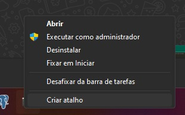
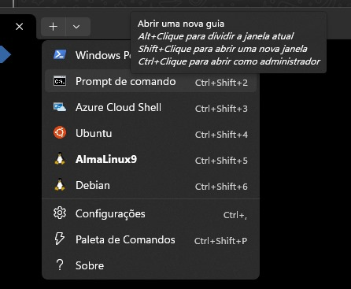

# Como configurar o etc\hosts no Windows

Abra o Terminal pressionando shift + botão direito do mouse, vai aparecer este menu, clique `Executar como administrador`

.

Abra uma aba com o `Prompt de comando`
.

Estando no `cmd.exe`, como Administrador, execute o comando:

```dos
echo "127.0.0.2 ava" >> c:\Windows\System32\drivers\etc\hosts
```
